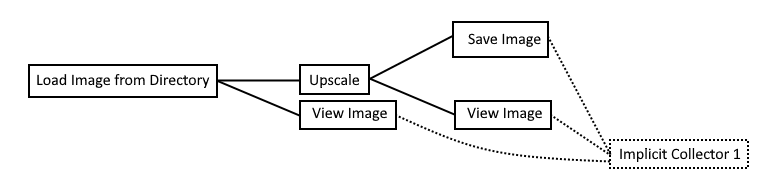

# New Iterator system

This document is intended to be the specification for the new iterator system.

## Goals

The main goal of the new iterator system is the following: In a chain without iterators, one node can be replaced with its iterator equivalent and the chain will still work as expected.

While this is the main goal, we want to achieve more of course, so here is a list of things the new iterator system has to be able to do:

- Mapping. The [`map` operator](https://docs.python.org/3.3/library/functions.html#map) is what the whole iterator concept will be built around. It is no understatement to say that `map` is fundamental. (E.g. given an iterator of images, upscale all images.)
- Folding. Given an iterator, we have to be able to convert it back into a regular value (e.g. combining a sequence of tiles into a sprite sheet).
- Nested loops. Iterators should be able to go through all combinations of 2 sets (e.g. upscale all images in this folder with all models in this folder).

Optional goals and future extensions:

- Filtering. The `filter` operator is a basic operator when it comes to iterators, and we should support it. However, it's not strictly necessary right now. Most of the requested use cases can be achieved without filtering.
- Conditionals. A conditional branch can be though of as an optional value, and an optional value can be though of as an iterator with either 0 or 1 elements. While this form of conditionals is very limited and might require a great deal of additional rules, it is nonetheless one way to achieve conditional logic in chainner.

## Non-goals

- Nested iterators. Right now, nested iterators (iterators where the items are iterators) are out of scope. Any way the user could create nested iterators must be disallowed. (In particular, generators must never be auto iterated.)

## What are iterators?

Iterators are lazily evaluated sequences with some item type `T`. They are commonly used in many programming languages, e.g. Python (`for ... in ...` works on iterators). Iterators represent a very useful abstraction: they are anything where items can be gone over one at a time. Their length is typically not know ahead of time.

Before you read on, please make sure that you fully understand what iterators are. I recommend reading [this](https://wiki.python.org/moin/Iterator) on Python's iterator interface and [this](https://wiki.python.org/moin/Generators) on Python generators.

In the following examples, I will typically use JavaScript-like pseudocode for iterator examples. The APIs used will be similar to JS's `Array` functions.

## Chainner as a programming language

Before, I start describing the semantics of the new iterator system, I will first explain how I think about chains.

Chains are simply a visual representation of a program. Each node is a function with any number of input (parameters) and outputs (return values). The links between nodes simply describe how variables are wired between them.

Example 1: Simple upscale \


This chain is equivalent to the following program:

```js
image, imageDir, imageName = LoadImage('C:/.../er.png');
model, modelDir, modelName = PyTorchLoadModel('C:/.../4x-UltraSharp.pth');
upscaledImage = UpscaleImage(model, image, AUTO);
SaveImage(upscaledImage, 'C:/.../', null, 'upscaled', PNG);
```

Old iterator nodes are simply equivalent to a `for` loop. Note that the `for` loop is part of the node itself.

Example 2: File iterator upscale \


```js
for (const [image, imageDir, subPath, imageName, index] of ImageIterator('C:/.../')) {
	model, modelDir, modelName = PyTorchLoadModel('C:/.../4x-UltraSharp.pth');
	upscaledImage = UpscaleImage(model, image, AUTO);
	SaveImage(upscaledImage, 'C:/.../', subPath, imageName, PNG);
}
```

However, another, more iterator-like, way of writing this code would be this:

```js
ImageIterator('C:/.../').forEach(([image, imageDir, subPath, imageName, index]) => {
	model, modelDir, modelName = PyTorchLoadModel('C:/.../4x-UltraSharp.pth');
	upscaledImage = UpscaleImage(model, image, AUTO);
	SaveImage(upscaledImage, 'C:/.../', subPath, imageName, PNG);
})
```

## New iterators

### Nomenclature

While the old iterator nodes iterated their sequences themselves, we now need to explicitly distinguish between nodes producing sequences of values, and those sequences.

1. Generator. A node that outputs at least one iterator.
2. Iterator. A sequence of values that can be iterated to obtain access to those values.
3. Collector. A node that takes at least one iterator as input and does not output any iterators.

### The basic idea

The basic idea of the new iterator system is that some iterators are compatible. Suppose the following chain:

Example 3: \


Here, *Load Image in Directory* is a generator and returns an iterator of images. Those images are then upscaled, and then the upscaled images are passed through *Average Color Fix* to fix any discolorations. The final images are then saved to disk. Obviously, I left out a few links for simplicity (e.g. links responsible for ensuring unique file names).

The important aspect of this chain is at *Average Color Fix*. This node is connected with 2 iterators (links 1 and 3). How will chainner iterate these 2 iterators? Should it be like this:

```js
// option 1 (nested iteration)
link_1.forEach((image1) => {
	link_3.forEach((image3) => {
		yield AverageColorFix(image1, image3)
	})
})
```

or like this:

```js
// option 2 (zip)
link_1.forEach((image1, index) => {
	image3 = link_3.at(index)
	yield AverageColorFix(image1, image3)
})
```

Well, suppose we replaced the *Load Image in Directory* node with a simple *Load Image* node. We could manually select all images in the directory of *Load Image in Directory* and run the chain for each one. This would behave exactly like option 2, so option 2 would be the correct behavior here.

Note: The operation in option 2 is called [zip](https://docs.python.org/3.3/library/functions.html#zip). However, this is a special because we know that both iterators (from link 1 and 3) have the same number of items. So we know that the zip will not discard any items.

### Auto iteration

As we can see, chainner automatically iterates over all images in the iterator produced by *Load Image in Directory*. This is called auto iteration. As we will see in the following example, auto iteration is not always possible/wanted, but more on that later.

While auto iteration nicely integrated all existing nodes into the new iterator system, it also has a problem: It is impossible for a node to take an iterator as whole instead of its iterated values.

To implement some nodes (e.g. a node for combining a sequence of images into a sprit sheet, or writing a sequence of images to disk as frames of a video), we need the node to handle the iteration itself. As such, we need a way to turn off auto iteration and to pass in the iterator directly as is.

This is where iterator input come in. These are special inputs that chainner knows need the iterator as is and must not be subject of auto iteration.

Note: Auto iteration is functionally equivalent to the `map` operation.

### The main problem

In the above example, we looked at how the new iterator system is supposed to function. Users can replace a node with a generator (here, *Load Image* was replaced with *Load Images in Directory*), and the chain will still work beautifully.

But what happens when we go further? Suppose we added another iterator. In this example, we'll look at the following chain:

Example 4: \


Here, all images are supposed to be upscaled with all models. So we want all possible combinations between images and models.

However, zipping isn't going to help us here. If we had 100 images and 3 models, zipping the iterators would result in us seeing 3 output images, not 300. So zipping isn't always the right way to combine 2 iterators.

The main problem with 2 iterators is this question: given 2 iterators, how should they be iterated to feed their values into the connected node?

Side note: We only have to answer this question for 2 iterators. The question for 2 iterators essentially boils down to "how can we combine 2 iterators to output one iterator". So n>2 iterators can similarly be combined by progressively reducing the iterators using the combinator.

### Iterator lineage

The answer to this problem is lineage. Lineage is a property of an iterator. It describes where the iterator came from (its generator) and tells us something about its number of items.

Lineage has the following rules:
1. A generator without iterator inputs (also called a source generator) has a unique lineage.
2. A generator with iterator inputs must derive their lineage from the lineage of their input iterators. The derivation function must be deterministic and only consider the input iterator lineages.
3. A non-generator without iterator inputs does not change lineage. (Auto iteration does not change lineage.)

If those rules are followed, we get the following guarantees for iterators with the same lineage:
1. They have the same number of items.
2. They have the same set of source generators.

These 2 guarantee together fix auto iteration. We will only allow auto iteration iff all connected iterators have the same lineage.

Using lineage, we can understand why example 3 works, but example 4 does not. In example 3, all iterators (link 1-4) have the same lineage, so auto iteration just works. But in example 4, *Load Images in Directory* and *Load Models in Directory* produce 2 iterators with different lineage, so auto iteration does not make sense.

### Iterator combinators

Since auto iteration is the only way for nodes to access iterator items for nodes without iterator inputs, a few nodes are iterator combinator nodes are needed.

An iterator combinator (or combinator for short) is a node that takes at least one iterator and outputs at least one iterator. All combinators must follow rule 2 of lineage.

The goal of combinators to allow for different modes of iteration by producing new iterators with a derived lineage.

#### Pairs

The best example of a combinator is the *Pairs* combinator. Given 2 iterators of any 2 lineages, it produces 2 iterators with the same lineage that together iterate through all possible pairs of items in the input iterators. This allows us to emulate nested loops.

Example: Given the iterators of `abcd` and `012`, *Pairs* will return the iterators for `abcdabcdabcd` and `012012012012`.

Here is example 4 fixed using the *Pairs* combinator.

Example 5: \


##### Open question: input order

Pairs has the property that the input order matters. Given 2 iterators *A* and *B*, *Pairs(A, B)* does not produce the same order in the produced iterators as *Pairs(B, A)*. This is because *Pairs* is a nested loop:

```js
function Pairs(A, B) {
	for (const a in A) {
		for (const b in B) {
			yield [a, b]
		}
	}
}
```

Changing which iterator is the inner and outer loop completely changes the item order in the returned iterator(s).

Example 6: \


This can cause hard-to-find bugs. In the above example, upscaled images are saved with names that have nothing to do with the image and model used.

So while order of input iterators (A,B vs B,A) is very important, should it also influence the lineage of the returned iterator(s)? If the lineage as order-dependent, then the above chain would simply be invalid.

##### Packing

Another solution to the problem of input order is packing. The problem is that the redundancy of having to repeat the input order over multiple *Pairs* nodes leads to the potential for mistakes. However, packing would allow users to combine multiple iterators into one.

The basic idea is that we have a *Pack* node that takes n>2 regular values and returns a tuple of those values. An *Unpack* node does the reverse: it takes a tuple of values and returns those values via n>2 outputs.

While *Pack* and *Unpack* will take some work to make them work in the current UI, they aren't specific to iterators. These nodes will be auto iterated.

The following example shows how the input order problem can be solved with *Pack* and *Unpack*:

Example 7: \


Because of packing, only one *Pairs* node is necessary.

Note: Since packing and upacking are currently only useful for the *Pairs* combinator, we might want to integrate *Pack* and *Unpack* directly into the *Pairs* node.

#### Zip

Users might want to compare the images of 2 directories. In this case, the *Zip* combinator may be used. Given 2 iterators of any lineage, it produces 2 iterators with the same lineage.

Example: Given the iterators of the sequences `abcd` and `012`, *Zip* will return the iterators for `abc` and `012`.

Note that the lineage of the output iterator(s) is not the same as either of the input iterators, it's a new lineage.

### Stability and caching

One of chaiNNer's principles for efficient execution is that values are cached and then discarded when they are no longer needed.

Unfortunately, this is significantly more difficult for executors. The main problem here is the *Pairs* combinator. Since this combinator duplicates items in the iterator, items need to be either cached until they are yielded the last time, or they need to be re-calculated. Both approaches have their up- and downsides.

- Caching is easy to implement, great for performance, and cheap if the average item size is relatively small (e.g. string or number items), but can consume huge amounts of memory
- Re-calculating is slower but saves a lot of memory as only one item is loaded at a time.

However, both approaches are only necessary for unstable iterators. Stable iterators are backed by collections (e.g. list, set) and can be iterated multiple times. Such iterators do not need to be cached or re-calculated.

I would suggest choosing which strategy by looking at the item type of the iterator. String and number iterators should be cached, because they likely won't take up a lot of memory (and if they do, we could fall be to re-calculating). While memory-intensive types (e.g. images) should be recalculated.

Of course, users should be able to influence these decisions. We could have a *Cached* combinator that takes an iterator with some lineage and returns a cached, stable version of that iterator.

### Implicit collectors

Since iterators are lazy by nature, none of the above iterator example would actually run. So we need something to drive their iteration. The solution to this problem are implicit collector nodes that consume all iterators.

The rule for implicit collectors are as follows:

1. Implicit collectors have side effects.
2. For each lineage, there exists one implicit collector.
3. Given an auto iterated node with side effects over lineage L, connect this node to the implicit collector of L.

These rules ensure that all nodes with side effects run while the chainner can still eliminate dead nodes.

Note: Since auto iteration is equivalent to a `map` operation, we assume that auto iterated nodes can always be connected to an implicit collector. This includes nodes like *View Image* and *Save Image* that have no connectable outputs.

### Lock-step iteration

Suppose we have the following chain:

Example 8: \


TODO:
