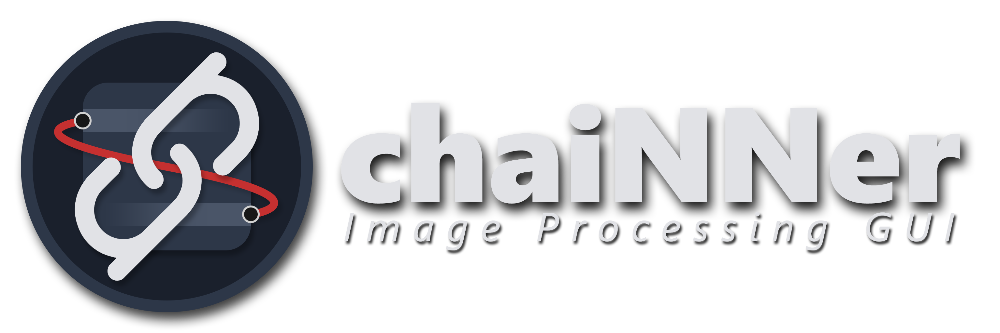
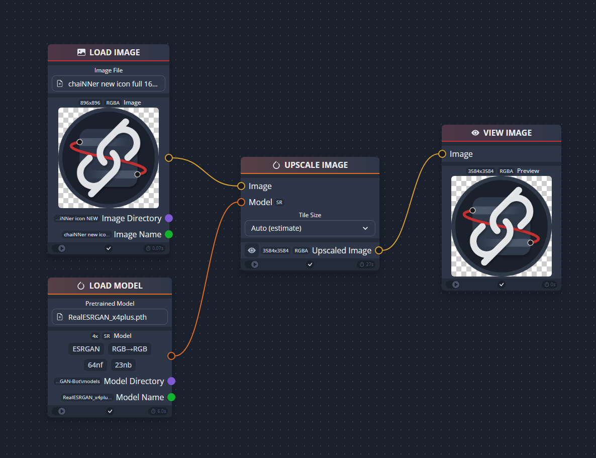
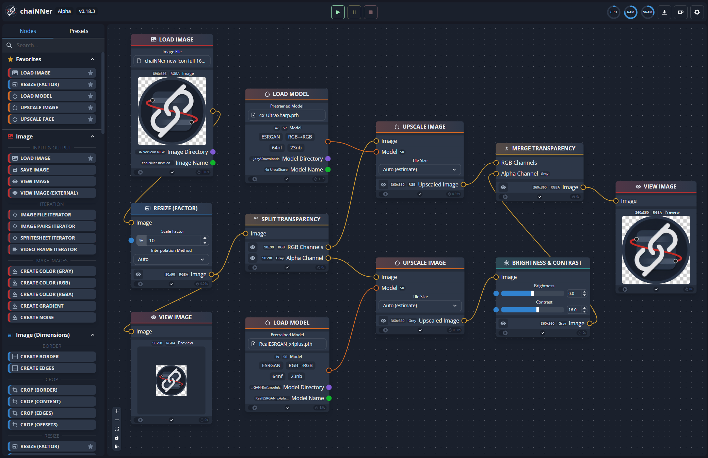

# chaiNNer

  

A node-based image processing GUI aimed at making chaining image processing tasks easy and customizable. Born as an AI upscaling application, chaiNNer has grown into an extremely flexible and powerful programmatic image processing application.

ChaiNNer gives you a level of customization of your image processing workflow that very few others do. Not only do you have full control over your processing pipeline, you can do incredibly complex tasks just by connecting a few nodes together.

ChaiNNer is also cross-platform, meaning you can run it on Windows, MacOS, and Linux.

For help, suggestions, or just to hang out, you can join the [chaiNNer Discord server](https://discord.gg/pzvAKPKyHM)

Remember: chaiNNer is still a work in progress and in alpha. While it is slowly getting more to where we want it, it is going to take quite some time to have every possible feature we want to add. If you're knowledgeable in TypeScript, React, or Python, feel free to contribute to this project and help us get closer to that goal.

## Installation

Download the latest release from the [Github releases page](https://github.com/chaiNNer-org/chaiNNer/releases) and run the installer best suited for your system. Simple as that.

You don't even need to have Python installed, as chaiNNer will download an isolated integrated Python build on startup. From there, you can install all the other dependencies via the Dependency Manager.

If you do wish to use your system Python installation still, you can turn the system Python setting on. However, it is much more recommended to use integrated Python. If you do wish to use your system Python, we recommend using Python 3.9, but theoretically later versions work as well.

## How To Use

### Basic Usage

While it might seem intimidating at first due to all the possible options, chaiNNer is pretty simple to use. For example, this is all you need to do in order to perform an upscale:

    

Before you get to this point though, you'll need to install one of the neural network frameworks from the dependency manager. You can access this via the button in the upper-right-hand corner. ChaiNNer offers support for PyTorch (with select model architectures), NCNN, and ONNX. For Nvidia users, PyTorch will be the preferred way to upscale. For AMD users, NCNN will be the preferred way to upscale.

All the other Python dependencies are automatically installed, and chaiNNer even carries its own integrated Python support so that you do not have to modify your existing Python configuration.

Then, all you have to do is drag and drop (or double click) node names in the selection panel to bring them into the editor. Then, drag from one node handle to another to connect the nodes. Each handle is color-coded to its specific type, and while connecting will show you only the compatible connections. This makes it very easy to know what to connect where.

Once you have a working chain set up in the editor, you can press the green "run" button in the top bar to run the chain you have made. You will see the connections between nodes become animated, and start to un-animate as they finish processing. You can stop or pause processing with the red "stop" and yellow "pause" buttons respectively. Note: pressing stop is usually unable to kill an in-progress upscale during the actual upscaling step. This is a known issue without a workaround at the moment, so just be patient and wait for it to finish or restart chaiNNer.

    

Don't forget, there are plenty of non-upscaling tasks you can do with chaiNNer as well!

### Tips & Tricks

To select multiple nodes, hold down shift and drag around all the nodes you want to be selected. You can also select an individual node by just clicking on it. When nodes are selected, you can press backspace or delete to delete them from the editor.

To batch upscale, create an Image Iterator node and drag the nodes you want to use into the iterator's editor area. You can expand the iterator by clicking and dragging the bottom right corner outwards (like you would a UI window). Simply wire up a chain in an iterator the same as you would normally, and when you click run it will run on every image in the folder you chose. You also can select an entire existing chain, and drag it into the iterator's editor area to essentially convert the entire thing into an iterable chain.

You can right-click in the editor viewport to show an inline nodes list to select from. You also can get this menu by dragging a connection out to the editor rather than making an actual connection, and it will show compatible nodes to automatically create a connection with.

### Helpful Resources

- [Kim's chaiNNer Templates](https://github.com/kimberly990/kim-chaiNNer-Templates/)
  - A collection of useful chain templates that can quickly get you started if you are still new to using chaiNNer.
- [OpenModelDB Model Database](https://openmodeldb.info/)
  - A nice collection of Super-Resolution models that have been trained by the community.
- [Upscale Wiki Model Database](https://upscale.wiki/wiki/Model_Database)
  - A more outdated collection of mostly ESRGAN models.
- [Interactive Visual Comparison of Upscaling Models](https://phhofm.github.io/upscale/multimodels.html)
  - An online comparison of different models. The author also provides a list of [favorites](https://phhofm.github.io/upscale/favorites.html).

## Compatibility Notes

- MacOS versions 10.x and below are not supported.

- Windows versions 8.1 and below are also not supported.

- Apple Silicon Macs should support almost everything. Although, ONNX only supports the CPU Execution Provider, and NCNN sometimes does not work properly.

- Some NCNN users with non-Nvidia GPUs might get all-black outputs. I am not sure what to do to fix this as it appears to be due to the graphics driver crashing as a result of going out of memory. If this happens to you, try manually setting a tiling amount.

- Arch Linux users may need to manually install libxcrypt before chaiNner's integrated Python will correctly start up.

- To use the Clipboard nodes, Linux users need to have xclip or, for wayland users, wl-copy installed.

## GPU Support

For PyTorch inference, only Nvidia GPUs are officially supported. If you do not have an Nvidia GPU, you will have to use PyTorch in CPU mode. This is because PyTorch only supports Nvidia's CUDA. MacOS users on Apple Silicon Macs can also take advantage of PyTorch's MPS mode, which should work with chaiNNer.

If you have an AMD or Intel GPU that supports NCNN however, chaiNNer now supports NCNN inference. You can use any existing NCNN .bin/.param model files (only ESRGAN-related SR models have been tested), or use chaiNNer to convert a PyTorch or ONNX model to NCNN.

For NCNN, make sure to select which GPU you want to use in the settings. It might be defaulting to your integrated graphics!

For Nvidia GPUs, ONNX is also an option to be used. ONNX will use CPU mode on non-Nvidia GPUs, similar to PyTorch.

## Model Architecture Support

ChaiNNer currently supports a limited amount of neural network architectures. More architectures will be supported in the future.

### Pytorch

#### Single Image Super Resolution

- [ESRGAN](https://github.com/xinntao/ESRGAN) (RRDBNet)
  - This includes regular [ESRGAN](https://github.com/xinntao/ESRGAN), [ESRGAN+](https://github.com/ncarraz/ESRGANplus), "new-arch ESRGAN" ([RealSR](https://github.com/jixiaozhong/RealSR), [BSRGAN](https://github.com/cszn/BSRGAN)), [SPSR](https://github.com/Maclory/SPSR), and [Real-ESRGAN](https://github.com/xinntao/Real-ESRGAN)
  - Models: [Community ESRGAN](https://upscale.wiki/wiki/Model_Database) | [ESRGAN+](https://drive.google.com/drive/folders/1lNky9afqEP-qdxrAwDFPJ1g0ui4x7Sin) | [BSRGAN](https://github.com/cszn/BSRGAN/tree/main/model_zoo) | [RealSR](https://github.com/jixiaozhong/RealSR#pre-trained-models) | [Real-ESRGAN](https://github.com/xinntao/Real-ESRGAN/blob/master/docs/model_zoo.md)
- [Real-ESRGAN Compact](https://github.com/xinntao/Real-ESRGAN) (SRVGGNet) | [Models](https://github.com/xinntao/Real-ESRGAN/blob/master/docs/model_zoo.md)
- [Swift-SRGAN](https://github.com/Koushik0901/Swift-SRGAN) | [Models](https://github.com/Koushik0901/Swift-SRGAN/releases/tag/v0.1)
- [SwinIR](https://github.com/JingyunLiang/SwinIR) | [Models](https://github.com/JingyunLiang/SwinIR/releases/tag/v0.0)
- [Swin2SR](https://github.com/mv-lab/swin2sr) | [Models](https://github.com/mv-lab/swin2sr/releases/tag/v0.0.1)
- [HAT](https://github.com/XPixelGroup/HAT) | [Models](https://drive.google.com/drive/folders/1HpmReFfoUqUbnAOQ7rvOeNU3uf_m69w0)
- [Omni-SR](https://github.com/Francis0625/Omni-SR) | [Models](https://github.com/Francis0625/Omni-SR#preparation)

#### Face Restoration

- [GFPGAN](https://github.com/TencentARC/GFPGAN) | [1.2](https://github.com/TencentARC/GFPGAN/releases/download/v1.3.0/GFPGANv1.2.pth), [1.3](https://github.com/TencentARC/GFPGAN/releases/download/v1.3.0/GFPGANv1.3.pth), [1.4](https://github.com/TencentARC/GFPGAN/releases/download/v1.3.4/GFPGANv1.4.pth)
- [RestoreFormer](https://github.com/wzhouxiff/RestoreFormer) | [Model](https://github.com/TencentARC/GFPGAN/releases/download/v1.3.4/RestoreFormer.pth)
- [CodeFormer](https://github.com/sczhou/CodeFormer) | [Model](https://github.com/sczhou/CodeFormer/releases/download/v0.1.0/codeformer.pth)

#### Inpainting

- [LaMa](https://github.com/advimman/lama) | [Model](https://github.com/Sanster/models/releases/download/add_big_lama/big-lama.pt)
- [MAT](https://github.com/fenglinglwb/MAT) | [Model](https://github.com/Sanster/models/releases/download/add_mat/Places_512_FullData_G.pth)

#### Denoising

- [SCUNet](https://github.com/cszn/SCUNet) | [GAN Model](https://github.com/cszn/KAIR/releases/download/v1.0/scunet_color_real_gan.pth) | [PSNR Model](https://github.com/cszn/KAIR/releases/download/v1.0/scunet_color_real_psnr.pth)

### NCNN

#### Single Image Super Resolution

- Technically, almost any SR model should work assuming they follow a typical CNN-based SR structure. However, I have only tested with ESRGAN (and its variants) and with Waifu2x.

### ONNX

#### Single Image Super Resolution

- Similarly to NCNN, technically almost any SR model should work assuming they follow a typical CNN-based SR structure. However, I have only tested with ESRGAN.

#### Background Removal

- [u2net](https://github.com/danielgatis/rembg) | [u2net](https://github.com/danielgatis/rembg/releases/download/v0.0.0/u2net.onnx), [u2netp](https://github.com/danielgatis/rembg/releases/download/v0.0.0/u2netp.onnx), [u2net_cloth_seg](https://github.com/danielgatis/rembg/releases/download/v0.0.0/u2net_cloth_seg.onnx), [u2net_human_seg](https://github.com/danielgatis/rembg/releases/download/v0.0.0/u2net_human_seg.onnx), [silueta](https://github.com/danielgatis/rembg/releases/download/v0.0.0/silueta.onnx)
- [isnet](https://github.com/xuebinqin/DIS) | [isnet](https://github.com/danielgatis/rembg/releases/download/v0.0.0/isnet-general-use.onnx)

## Troubleshooting

For troubleshooting information, view the [troubleshooting document](docs/troubleshooting.md).

## Building chaiNNer Yourself

I provide pre-built versions of chaiNNer here on GitHub. However, if you would like to build chaiNNer yourself, simply run `npm install` (make sure that you have at least npm v7 installed) to install all the nodejs dependencies, and `npm run make` to build the application.

## FAQ

For FAQ information, view the [FAQ document](docs/FAQ.md).
