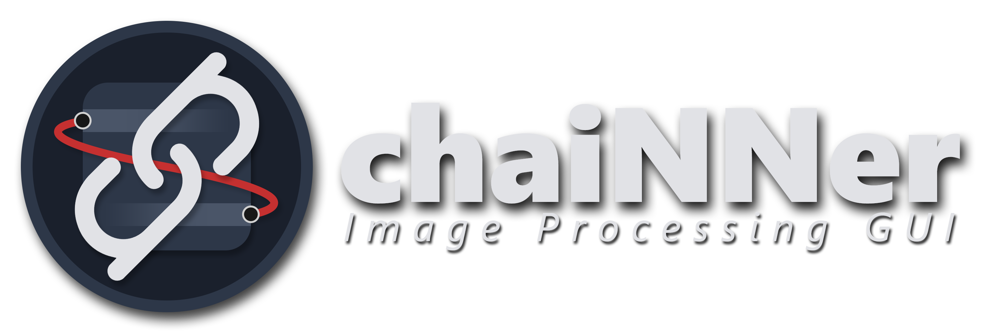
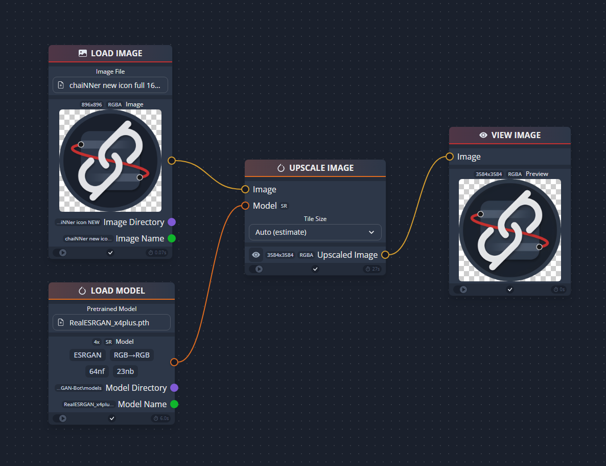
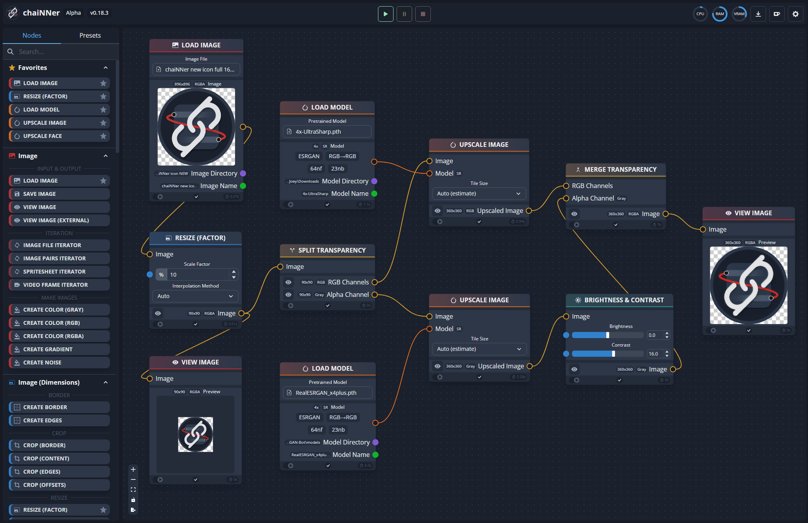

# chaiNNer

  

A custom fork of node-based image processing GUI aimed at making chaining image processing tasks easy and customizable. Born as an AI upscaling application, chaiNNer has grown into an extremely flexible and powerful programmatic image processing application.

ChaiNNer gives you a level of customization of your image processing workflow that very few others do. Not only do you have full control over your processing pipeline, you can do incredibly complex tasks just by connecting a few nodes together.

For help, suggestions, or just to hang out, you can join the [original chaiNNer Discord server](https://discord.gg/pzvAKPKyHM)

This fork of ChaiNNer is not in active development, and only upgraded for Image upscale purposes.

## Installation

Download the latest release from the [Github releases page](https://github.com/florentia-mysteria/chaiNNer-rocm-windows/releases) and run the installer best suited for your system. Simple as that.

You don't even need to have Python installed, as chaiNNer will download an isolated integrated Python build on startup. From there, you can install all the other dependencies via the Dependency Manager.

If you do wish to use your system Python installation still, you can turn the system Python setting on. However, it is much more recommended to use integrated Python. If you do wish to use your system Python, Python 3.10 or later is required (3.11+ recommended).

If you'd like to test the latest changes and tweaks, try out our nightly builds

## How To Use

### Basic Usage

While it might seem intimidating at first due to all the possible options, chaiNNer is pretty simple to use. For example, this is all you need to do in order to perform an upscale:

    

Before you get to this point though, you'll need to install one of the neural network frameworks from the dependency manager. You can access this via the button in the upper-right-hand corner. ChaiNNer offers support for PyTorch (with select model architectures), NCNN, ONNX, and TensorRT. For Nvidia users, PyTorch or TensorRT will be the preferred way to upscale. For AMD users, NCNN will be the preferred way to upscale (or PyTorch with ROCm on Linux).

All the other Python dependencies are automatically installed, and chaiNNer even carries its own integrated Python support so that you do not have to modify your existing Python configuration.

Then, all you have to do is drag and drop (or double click) node names in the selection panel to bring them into the editor. Then, drag from one node handle to another to connect the nodes. Each handle is color-coded to its specific type, and while connecting will show you only the compatible connections. This makes it very easy to know what to connect where.

Once you have a working chain set up in the editor, you can press the green "run" button in the top bar to run the chain you have made. You will see the connections between nodes become animated, and start to un-animate as they finish processing. You can stop or pause processing with the red "stop" and yellow "pause" buttons respectively.

    

Don't forget, there are plenty of non-upscaling tasks you can do with chaiNNer as well!

### Tips & Tricks

To select multiple nodes, hold down shift and drag around all the nodes you want to be selected. You can also select an individual node by just clicking on it. When nodes are selected, you can press backspace or delete to delete them from the editor.

To perform batch processing on a folder of images, use the "Load Images" node. To process videos, use the "Load Video" node. It's important to note however that you cannot use both "Load Images" and "Load Video" nodes (or any two nodes that perform batch iteration) together in a chain. You can however combine the output (collector) nodes in the chain, for example using "Save Image" with "Load Video", and "Save Video" with "Load Images".

You can right-click in the editor viewport to show an inline nodes list to select from. You also can get this menu by dragging a connection out to the editor rather than making an actual connection, and it will show compatible nodes to automatically create a connection with.

### Helpful Resources

-   [Kim's chaiNNer Templates](https://github.com/kimberly990/kim-chaiNNer-Templates/)
    -   A collection of useful chain templates that can quickly get you started if you are still new to using chaiNNer.
-   [OpenModelDB Model Database](https://openmodeldb.info/)
    -   A nice collection of Super-Resolution models that have been trained by the community.
-   [Interactive Visual Comparison of Upscaling Models](https://phhofm.github.io/upscale/multimodels.html)
    -   An online comparison of different models. The author also provides a list of [favorites](https://phhofm.github.io/upscale/favorites.html).

## Compatibility Notes

-   Windows versions 8.1 and below are not supported.

-   Linux support is not tested for this fork.

-   Required ROCm 10 compatible GPU (RX7600 or higher) or APU (Ryzen 3 210 or higher)

## GPU Support

**Nvidia GPUs:** Full support via PyTorch (CUDA), ONNX, and TensorRT. TensorRT offers the best performance for supported models.

**AMD GPUs:**
- Windows ROCm support from the box.

**CPU:** All frameworks support CPU-only mode as a fallback.

For NCNN, make sure to select which GPU you want to use in the settings. It might be defaulting to your integrated graphics!

## Model Architecture Support

ChaiNNer currently supports a limited amount of neural network architectures. More architectures will be supported in the future.

### PyTorch

As of v0.21.0, chaiNNer uses original [chaiNNER](https://github.com/chaiNNer-org/chaiNNer) package called [Spandrel](https://github.com/chaiNNer-org/spandrel) to support Pytorch model architectures. For a list of what's supported, [check out the list there](https://github.com/chaiNNer-org/spandrel#model-architecture-support).

### NCNN

#### Single Image Super Resolution

-   Technically, almost any SR model should work assuming they follow a typical CNN-based SR structure. However, I have only tested with ESRGAN (and its variants) and with Waifu2x.

### ONNX

#### Single Image Super Resolution

-   Similarly to NCNN, technically almost any SR model should work assuming they follow a typical CNN-based SR structure. However, I have only tested with ESRGAN.

#### Background Removal

-   [u2net](https://github.com/danielgatis/rembg) | [u2net](https://github.com/danielgatis/rembg/releases/download/v0.0.0/u2net.onnx), [u2netp](https://github.com/danielgatis/rembg/releases/download/v0.0.0/u2netp.onnx), [u2net_cloth_seg](https://github.com/danielgatis/rembg/releases/download/v0.0.0/u2net_cloth_seg.onnx), [u2net_human_seg](https://github.com/danielgatis/rembg/releases/download/v0.0.0/u2net_human_seg.onnx), [silueta](https://github.com/danielgatis/rembg/releases/download/v0.0.0/silueta.onnx)
-   [isnet](https://github.com/xuebinqin/DIS) | [isnet](https://github.com/danielgatis/rembg/releases/download/v0.0.0/isnet-general-use.onnx)

### TensorRT

TensorRT provides optimized inference for Nvidia GPUs. Models must be converted to TensorRT engine format for use. This offers the best performance on supported hardware.

## Troubleshooting

For troubleshooting information, view the [troubleshooting document](https://github.com/chaiNNer-org/chaiNNer/wiki/06--Troubleshooting).

## Building chaiNNer Yourself

I provide pre-built versions of chaiNNer here on GitHub. However, if you would like to build chaiNNer yourself, simply run `npm install` (make sure that you have at least npm v7 installed) to install all the nodejs dependencies, and `npm run make` to build the application.

## FAQ

For FAQ information, view the [FAQ document](https://github.com/chaiNNer-org/chaiNNer/wiki/07--FAQ).

## Documentation

For in-depth documentation covering various aspects of ChaiNNer, including CLI usage, data representation, and a contributor's guide, refer to original [ChaiNNer Wiki](https://github.com/chaiNNer-org/chaiNNer/wiki).

