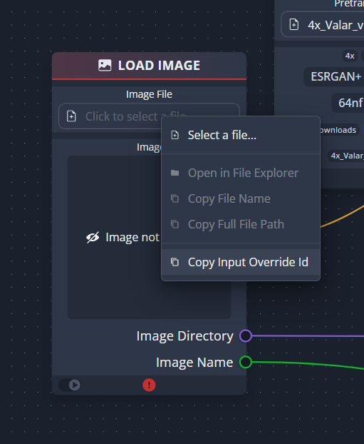

# CLI

CLI mode lets you use ChaiNNer without a GUI. This is useful for running ChaiNNer on a server or in a Docker container.

**IMPORTANT:** CLI mode is **experimental** and may change in the future. It is not recommended to use it in production. All of its features are subject to change.

**IMPORTANT:** CLI mode currently has a bug that prevents you from seeing the console outputs of `chainner.exe`. This is a known issue and will be fixed in the future.

## Introduction

In some cases, you may want to run ChaiNNer without the GUI. E.g. to programmatically run the same chain with different inputs. As such, CLI mode is a way for advanced users with programming experience to work around the limitations of GUI chaiNNer.

Conceptually, CLI mode simply opens a `.chn` chain files and runs it. It's the same as if you opened the chain in the GUI and pressed the "Run" button. Of course, CLI mode has a way to set the inputs of nodes within the chain before running it.

## Usage

The basic command of CLI mode is this:

```
chainner.exe run "path/to/your-chain.chn"
```

This will run the chain as is, without changing any inputs. The exit code of the program will be `0` if the chain ran successfully, and non-zero if it failed.

If you want to change the inputs of nodes within the chain, you can specify a file with input overrides like so:

```
chainner.exe run "path/to/your-chain.chn" --override "path/to/your-input-overrides.json"
```

## Input overrides

Input overrides are a JSON file that specifies the inputs of nodes within the chain. The format is as follows:

```ts
{
    "inputs": {
        "<input override id>": string | number | null
    }
}
```

You can specify as many input overrides as you want.

To get the input override ID of a specific input, open the chain in the GUI and right-click the input. Then click "Copy Input Override ID". This will copy the input override ID to your clipboard.



### Supported inputs

The following inputs support overrides:

-   Text input
-   Number input
-   File input
-   Directory input

Dropdown, checkbox, and generic inputs do not support overrides.

### Override values

Overrides can be either a string, a number, or `null`.

The value of the override depends on the type of the input. E.g. use a number for a number input, and a string for a text input. Using strings to override number inputs will result in an error.

`null` is used to reset optional inputs. It will not reset inputs to their default value, but rather remove the input value. This is only useful for a few optional text inputs in chaiNNer.
